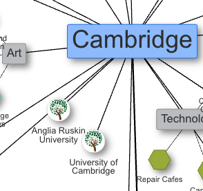

# 🆕 What's new

### November 2025

* Replaced signin via Magic Link with signin via Email One-Time Passcode.
  * This resolves an issue encountered by people using workplace email inboxes.

### October 2025

* Migrated web host from Vercel to Netlify.
* Dynamic action buttons for listings. Any listing can now have individual buttons for different actions that visitors can take: Volunteer, Contact, Donate, Newsletter and Resources.

<figure><figcaption></figcaption></figure>

### July 2025

* Migrated to new transactional and marketing email service, Mailersend and Mailerlite. This is due to Sendgrid, our old email service is axing its free plan.
* Editing listings: anyone can now add/update the location of a listing (subject to approval by the respective web owners of course).
* Team owners are now able to remove other team members if they want to leave the team (except owners).
* Webs can now have a location and a contact email set. These will be displayed on a brand new "web homepage", for example this is the one for Durham: [https://durham.resilienceweb.org.uk/web](https://durham.resilienceweb.org.uk/web)

### 31 May 2025

* Links to related/neighbouring webs
  * Web owners can now add links to other webs that are either close geographically or related in some way. If you are a web owner, go to Web Settings to see the new section for adding links.

<figure><figcaption></figcaption></figure>

### 2 May 2025

* New webs are now highlighted on the homepage and displayed first.

<figure><figcaption></figcaption></figure>

### 23 April 2025

* Custom icons for Web view and Map view

<figure><figcaption></figcaption></figure> <figure><figcaption></figcaption></figure>

* Map view is now available 🎉. It is enabled by admins for webs that have more than 50% of listings with location data set. If the categories of the listings have a custom icon set (see above) that will also be displayed.

<figure><figcaption></figcaption></figure>

*

### 13 December 2024

*   Anyone can now suggest changes and corrections to any listing :tada:

    * Note: a listing can only have one edit suggestion in progress at one time

    <figure><figcaption></figcaption></figure>
* Admins can review those changes, and either accept or reject them

<figure><figcaption></figcaption></figure>

### 8 November 2024

*   Location can now be selected when adding/editing a listing in Admin

    <figure><figcaption></figcaption></figure>
*   That location is then displayed on the individual listing page

    <figure><figcaption></figcaption></figure>

We will work on displaying all the listings together in the map, stay tuned :raised\_hands: In the meantime, please add the location to as many listings as you can. Of course, there are many organisations that don't have a fixed address, in which case there's no need to do so. We will find a way to display them in/alongside the Map view either way.

### 26 October 2024

* Listings can now be featured, which will pin them to the top of the page for 7 days

<figure><figcaption></figcaption></figure>

### 18 October 2024

* You can now add a tag to multiple listings at once

<figure><figcaption></figcaption></figure>

<figure><figcaption></figcaption></figure>

### 2 October 2024

* Performance and optimisations around images
  * Compress listing images on upload
  * Ensure deleting listing also deletes associated image
  * Upgraded to new asset upload library
* Added Propose listing button on empty search screen

<figure><figcaption></figcaption></figure>

* \[Maintainer] Added way to see at a glance which listings don't have an image or have a very short description (less than 50 characters)

<figure><figcaption></figcaption></figure>

* \[Admin] Added Publish button so admins can publish webs without a manual database change by developer
* Fixed various bugs

**Improvements to network view** 🌐

* Better layout and reduced overlapping of listings
* Added tooltip that shows tags for each listing

<figure><figcaption></figcaption></figure>

### 1 September 2024

**Platform improvements ⚙️**

Over the past few weeks we've worked on improving our systems under the hood. This resulted in improved performance for those who use the admin dashboard, as well as simpler architecture and code, which will make it simpler for us to deliver new features going forward.

Here are other small things we've shipped:

* \[Admin] Minor improvements to the list of team members displayed on the Team page
* \[Admin] Fixed a few bugs that some new users were encountering when signing up and trying to create a new web

### 26 June 2024

* \[Admin] Fixed a bug where signing in with a different account sometimes got users stuck in a non-recoverable state
* \[Admin] Added way of selecting the location for a web (feature currently in Beta)

<figure><figcaption></figcaption></figure>

* Added FAQ section to web creation page

<figure><figcaption>
FAQ section on the Web Creation page
</figcaption></figure>

### 6 May 2024

* Added description field to Web that is now shown on the sidebar on the individual Web page (where listings are displayed)
* Added menu item 'Create your own web' to dropdown that displays the Webs on the homepage
* Now displaying banner for webs that are not published yet, to show that they are still being worked on

<figure><figcaption></figcaption></figure>

* Added new User Settings page to admin area where users can set/update their name and subscribe to the Resilience Web newsletter

<figure><figcaption></figcaption></figure>

### 26 April 2024

* Fixed an issue where users could not propose listings for webs that were not yet 'published'
* Fixed issue that caused webs on homepage to take a long time to load
* Fixed issue where new posts in the News section were not displayed without a full site rebuild
* \[Admin] Added button to Overview page for individual web that makes it easy to contact all the web owners and editors at once.

<figure><figcaption>
New 'Send email to owners and editors' button
</figcaption></figure>

### 19 March 2024

* Added link for users to create a new web to the website homepage 🎉

<figure><figcaption></figcaption></figure>

### 18 March 2024

We've redesigned the admin dashboard :raised\_hands::computer: If you manage one of the webs on our platform, you've been using the dashboard to add or update listings, manage your team and more. We are hoping these changes will make your life easier. If you have any feedback please do let us know.

As a bonus you can now also get in touch directly from the admin dashboard!

<figure><figcaption></figcaption></figure>
