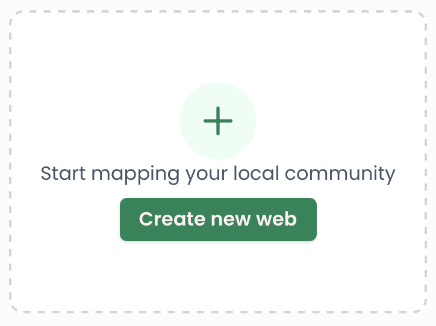

# Create a Web

This guide will walk you through creating a new web.

1. On [https://resilienceweb.org.uk](https://resilienceweb.org.uk) click the button “Create a new web” at the end of the listing of existing webs

2. You will be asked to sign up with your name and the email address you want to use to manage the web.
3. We will email you a one-time sign-in code. Enter the code on the verification page to sign in. You do not need a password — each time you sign in, we send a fresh code to your email. Note that each code expires after 10 minutes, but you can always request a new one.
4. You will then be taken to a welcome form that asks for the following information, all of which can be changed later in Web Settings:
   1. the title of the web (e.g. the name of your town)
   2. the link for your web (e.g. york.resilienceweb.org.uk) — this is generated automatically from the title, but you can change it
   3. a contact email where people can reach your team with questions or feedback
   4. a description for the web
   5. a location for the web
5. Press “Get started” and you will be taken to the admin dashboard of your new web, where a short tour will show you around.
6. You can now add listings, edit categories, and set the banner image for your web.
7. If you are collaborating with people on the web, you can invite them from the Team page.
