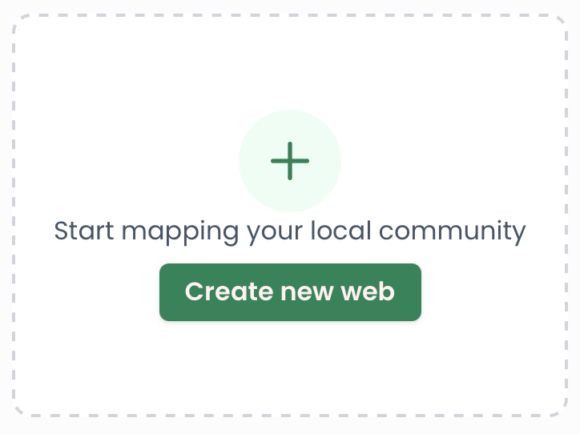

# Create a Web

This guide will walk you through creating a new web. &#x20;

1. On [https://resilienceweb.org.uk](https://resilienceweb.org.uk) click the button “Create a new web” at the end of the listing of existing webs

2. You will be asked for an email address to manage the web, enter yours.
3. An email will be sent to the address you specified. Go to the mail and click on the link to log in.  You do not need a password to access your web, you will always access it through a link sent to your email.&#x20;
4. The link will take you to a form that will ask you for the following information, all of which can be changed later:
   1. the name of the web
   2. a description for the web
   3. a location for the web
5. Submit that form and you will be taken to the empty web.&#x20;
6. You can now add listings, edit categories, and set the banner image for your web.
7. If you are collaborating with people on the web, you can add them as owners under Team.

